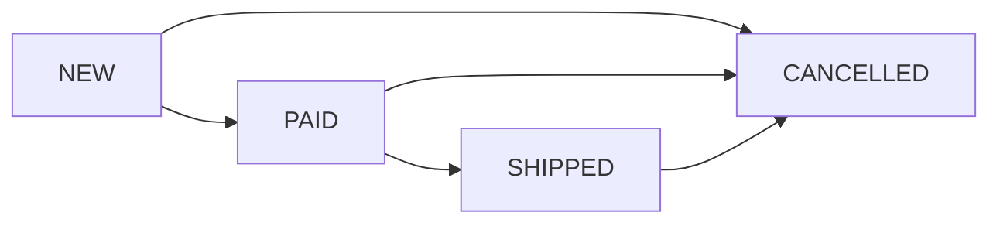

# Order Management System API

A simple order management system built with Symfony 7.2 and API Platform. This system allows managing customer orders through a RESTful API.

## System Architecture

### Class Diagram


### Deployment Diagram


## Features

- Create new orders with multiple items
- Retrieve order details
- Update order status with validation
- List all orders with filtering and sorting
- Status transition validation (e.g., can't go from "new" to "shipped")
- Data fixtures for testing
- Unit tests

## Technical Stack

- PHP 8.3+
- Symfony 7.2
- API Platform
- Doctrine ORM
- SQLite database
- PHPUnit for testing

## Installation

1. Clone the repository:
```bash
git clone [repository-url]
cd [project-directory]
```

2. Install dependencies:
```bash
composer install
```

3. Set up the database:
```bash
php bin/console doctrine:schema:create
```

4. (Optional) Load test data:
```bash
php bin/console doctrine:fixtures:load
```

5. Start the Symfony development server:
```bash
php -S localhost:8000 -t public/
```

## API Endpoints

### API Endpoints Details

#### 1. Create Order (POST /api/orders)
Creates a new order with items.

**Request:**
```http
POST /api/orders
Content-Type: application/ld+json
Accept: application/ld+json

{
  "items": [
    {
      "productId": "1",
      "productName": "Test Product",
      "price": "100.00",
      "quantity": 2
    }
  ]
}
```

**Response:** (201 Created)
```json
{
  "@context": "/api/contexts/Order",
  "@id": "/api/orders/{id}",
  "@type": "Order",
  "id": "uuid",
  "createdAt": "2024-03-15T10:00:00+00:00",
  "status": "new",
  "items": [
    {
      "@id": "/api/order_items/{id}",
      "@type": "OrderItem",
      "id": 1,
      "productId": "1",
      "productName": "Test Product",
      "price": "100.00",
      "quantity": 2
    }
  ],
  "total": "200.00"
}
```

#### 2. Get Orders List (GET /api/orders)
Retrieves a list of all orders with pagination.

**Request:**
```http
GET /api/orders
Accept: application/ld+json
```

**Optional Query Parameters:**
- `status`: Filter by order status (new, paid, shipped, cancelled)
- `order[createdAt]`: Sort by creation date (asc, desc)
- `page`: Page number (default: 1)
- `itemsPerPage`: Items per page (default: 30)

**Response:** (200 OK)
```json
{
  "@context": "/api/contexts/Order",
  "@id": "/api/orders",
  "@type": "hydra:Collection",
  "hydra:member": [
    {
      "@id": "/api/orders/{id}",
      "@type": "Order",
      "id": "uuid",
      "createdAt": "2024-03-15T10:00:00+00:00",
      "status": "new",
      "items": [...],
      "total": "200.00"
    }
  ],
  "hydra:totalItems": 1
}
```

#### 3. Get Single Order (GET /api/orders/{id})
Retrieves details of a specific order.

**Request:**
```http
GET /api/orders/{id}
Accept: application/ld+json
```

**Response:** (200 OK)
```json
{
  "@context": "/api/contexts/Order",
  "@id": "/api/orders/{id}",
  "@type": "Order",
  "id": "uuid",
  "createdAt": "2024-03-15T10:00:00+00:00",
  "status": "new",
  "items": [...],
  "total": "200.00"
}
```

#### 4. Update Order Status (PATCH /api/orders/{id})
Updates the status of an existing order.

**Request:**
```http
PATCH /api/orders/{id}
Content-Type: application/merge-patch+json
Accept: application/ld+json

{
  "status": "paid"
}
```

**Response:** (200 OK)
```json
{
  "@context": "/api/contexts/Order",
  "@id": "/api/orders/{id}",
  "@type": "Order",
  "id": "uuid",
  "createdAt": "2024-03-15T10:00:00+00:00",
  "status": "paid",
  "items": [...],
  "total": "200.00"
}
```

### Error Responses

#### 400 Bad Request
```json
{
  "@context": "/api/contexts/Error",
  "@type": "hydra:Error",
  "hydra:title": "An error occurred",
  "hydra:description": "Invalid input data"
}
```

#### 404 Not Found
```json
{
  "@context": "/api/contexts/Error",
  "@type": "hydra:Error",
  "hydra:title": "Not Found",
  "hydra:description": "Order not found"
}
```

#### 422 Unprocessable Entity
```json
{
  "@context": "/api/contexts/ConstraintViolationList",
  "@type": "ConstraintViolationList",
  "hydra:title": "An error occurred",
  "hydra:description": "status: Invalid status transition from \"shipped\" to \"new\".",
  "violations": [
    {
      "propertyPath": "status",
      "message": "Invalid status transition from \"shipped\" to \"new\"."
    }
  ]
}
```

### Status Transitions
Valid status transitions are:
- `new` → `paid`, `cancelled`
- `paid` → `shipped`, `cancelled`
- `shipped` → `cancelled`
- `cancelled` → (no further transitions allowed)

## Order Status Flow

The system implements the following status transitions:


## Data Model

### Order
- `id` (UUID)
- `createdAt` (DateTime)
- `status` (string: new, paid, shipped, cancelled)
- `items` (Collection of OrderItem)
- `total` (decimal)

### OrderItem
- `id` (int)
- `productId` (string)
- `productName` (string)
- `price` (decimal)
- `quantity` (int)

## Testing

Run the test suite:
```bash
php bin/phpunit
```

## API Documentation

### Interactive Documentation
Access the Swagger/OpenAPI documentation interface at:
```
http://localhost:8000/api
```
